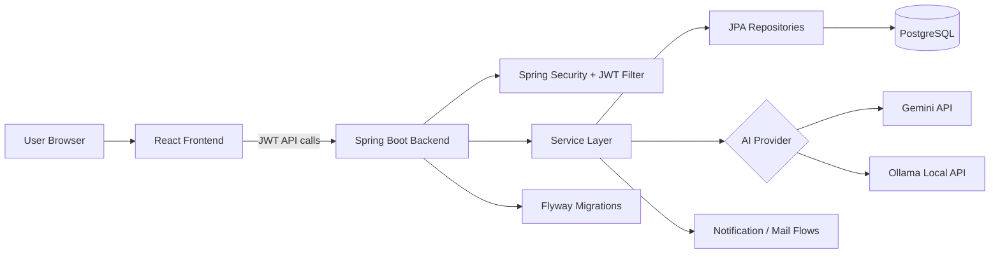
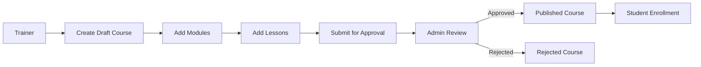
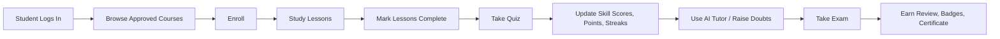
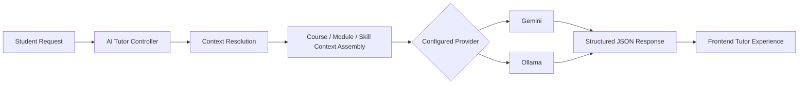

# Skill Forge

Skill Forge is a role-based learning platform for technical upskilling. It combines a Spring Boot backend, a React frontend, adaptive assessments, AI-assisted tutoring, trainer-led course authoring, admin moderation, and learner engagement systems such as streaks, badges, certificates, and leaderboards.

## What the project does

The platform supports three core roles:

- `STUDENT`: enrolls in courses, completes lessons, takes quizzes and exams, uses AI tutoring, raises doubts, tracks mastery, earns points, badges, and certificates.
- `TRAINER`: creates courses, modules, and lessons, generates exams, reviews learner doubts, and tracks authored-course activity.
- `ADMIN`: approves trainers, moderates course publishing, manages users, reviews platform metrics, and can operate across moderation/support workflows.

## Core features

### Authentication and access control

- JWT-based stateless authentication
- Email/password login
- OTP-based login
- OTP-based forgot-password reset
- Role-aware route protection in both backend and frontend
- Admin approval flow for trainer accounts
- Active/inactive user status management

### Learning and course delivery

- Trainer course creation in draft mode
- Module and lesson authoring
- Lesson content support for text, image, and video payloads
- Admin course approval and rejection workflow
- Student enrollment into approved courses
- Lesson completion tracking
- Course progress calculation per learner

### Assessments

- Module quizzes
- Adaptive quiz rounds that generate follow-up questions for weak concepts
- Skill score updates by concept after quiz completion
- Reusable course exams
- AI-generated exam drafts with fallback generation from existing question pools
- Exam attempt review after submission
- Proctor-event capture during exams

### AI-powered learning support

- AI tutor teaching flow for a selected concept
- AI doubt solving with recent chat history
- AI reflection feedback
- AI-generated mock scenarios based on completed courses
- Pluggable AI provider abstraction
- Hosted Gemini support
- Local Ollama support

### Engagement and learner support

- Global leaderboard by points
- Streak leaderboard
- Knowledge-check streak tracking
- Notifications for enrollment, moderation, quiz/exam completion, badge unlocks, and doubt resolution
- Student doubt creation and trainer/admin resolution
- Achievement badges
- Course completion certificates
- Course recommendations based on weaker concepts

### Dashboards

- Student dashboard with enrollments, quiz activity, notifications, streaks, and points
- Trainer dashboard with created courses, pending approvals, enrollments, question counts, and quiz activity
- Admin dashboard with user and moderation metrics

## Tech stack

### Backend

- Java 17
- Spring Boot 4
- Spring Web MVC
- Spring Security
- Spring Data JPA
- Flyway
- PostgreSQL
- JavaMailSender
- JWT via `jjwt`

### Frontend

- React 19
- TypeScript
- Vite
- React Router
- TanStack Query
- Zustand
- Axios
- Tailwind CSS 4
- Radix-based UI primitives
- Framer Motion
- Recharts

## System design

Skill Forge is a client-server application with a React SPA talking to a Spring Boot REST API. The backend owns authentication, authorization, business workflows, persistence, AI orchestration, notifications, and scoring logic. PostgreSQL stores operational data, while Flyway manages schema evolution. The AI layer is abstracted so the same workflows can call either Gemini or Ollama.

### High-level architecture



### Backend architecture

The backend follows a standard layered structure:

- `controller`: REST endpoints for auth, courses, quizzes, exams, dashboards, AI, support, users, notifications, and leaderboard
- `service`: business logic, workflow coordination, AI prompt assembly, scoring, engagement rules
- `repository`: persistence access with Spring Data JPA
- `entity`: domain model for users, courses, lessons, assessments, support artifacts, and engagement state
- `dto`: request and response payloads
- `config` and `security`: JWT filter, CORS, security policy, AI configuration, bootstrap admin
- `db/migration`: Flyway schema and seed scripts

### Frontend architecture

The React app is role-driven and route-based:

- `pages/auth`: registration, login, OTP verification, forgot password, reset password
- `pages/student`: dashboard, course catalog, player, quizzes, exams, leaderboard, support, skill mastery
- `pages/trainer`: dashboard, course builder, assessments
- `pages/admin`: dashboard, user management, course moderation, support desk
- `api`: API clients grouped by domain
- `store`: auth, theme, and UI state
- `layouts`: auth layout, dashboard layout, sidebar, top navigation

## Major domain modules

### 1. Identity and user lifecycle

- New students become active immediately.
- New trainers are created in `PENDING_APPROVAL`.
- Admins can approve trainers and activate/deactivate any user.
- Login returns a JWT carrying the authenticated identity and role.

### 2. Course lifecycle

- Trainer creates a draft course.
- Trainer adds modules.
- Trainer adds lessons to modules.
- Trainer submits the course for review.
- Admin approves or rejects.
- Students can enroll only after approval.

### 3. Assessment lifecycle

- Trainers seed module questions.
- Students take quizzes on modules.
- Weak concepts can trigger adaptive rounds with more questions.
- Trainers or admins can generate reusable course exams.
- Students start attempts, submit answers, and receive scored reviews.
- Proctor events contribute to a proctoring score.

### 4. Support and motivation lifecycle

- Students raise doubts.
- Trainers or admins resolve them.
- Quiz and exam completion update points and streaks.
- Completed course and performance conditions unlock certificates and badges.
- Recommendations are computed from weak-concept overlap.

## Use case diagram

```mermaid
flowchart TB
    Student((Student))
    Trainer((Trainer))
    Admin((Admin))

    Student --> UC1[Register / Login / OTP Login]
    Student --> UC2[Browse and Enroll in Courses]
    Student --> UC3[Complete Lessons]
    Student --> UC4[Take Adaptive Quizzes]
    Student --> UC5[Take Exams]
    Student --> UC6[Use AI Tutor]
    Student --> UC7[Raise Doubts]
    Student --> UC8[View Leaderboard, Badges, Certificates]

    Trainer --> UC9[Create Courses]
    Trainer --> UC10[Add Modules and Lessons]
    Trainer --> UC11[Submit Courses for Approval]
    Trainer --> UC12[Generate Exams]
    Trainer --> UC13[Resolve Student Doubts]
    Trainer --> UC14[View Trainer Dashboard]

    Admin --> UC15[Approve Trainers]
    Admin --> UC16[Moderate Courses]
    Admin --> UC17[Manage User Status]
    Admin --> UC18[Resolve Doubts]
    Admin --> UC19[View Platform Dashboard]
```



## Workflow diagrams

### Course publishing workflow



### Student learning workflow



### AI tutoring workflow



## Request flow

Most secured requests follow the same pattern:

1. React page calls a domain API client through Axios.
2. JWT is attached to the request.
3. Spring Security validates the token in `JwtAuthenticationFilter`.
4. Controller validates payload and delegates to a service.
5. Service executes business rules and uses repositories.
6. Data is persisted in PostgreSQL.
7. DTO response is returned to the frontend.

## Database and persistence

Flyway migrations live in `src/main/resources/db/migration` and define the evolving schema. Based on the migration set and entities, the main persisted domains are:

- users and role-specific profiles
- OTP tokens
- courses, modules, lessons, enrollments, lesson progress
- questions, quiz attempts, quiz attempt answers
- course exams, exam questions, exam attempts, proctor events
- notifications
- leaderboard entries
- doubts
- badges, certificates
- user skill levels

## API surface

The backend is organized around these endpoint groups:

- `/api/auth`: registration, login, OTP login, forgot-password reset
- `/api/users`: current user profile, admin user management, trainer approval
- `/api/courses`, `/api/modules`, `/api/lessons`: course authoring, outlines, enrollment, completion
- `/api/quiz`: quiz submission and adaptive rounds
- `/api/skills/me`: learner mastery snapshot
- `/api/ai`: tutor teach/doubt/feedback and mock generation
- `/api/dashboard`: student, trainer, and admin summaries
- `/api/leaderboard`: points and streak boards
- `/api/notifications`: feed and mark-read flow
- `/api/doubts`: create, list, and resolve support tickets
- `/api/exams`, `/api/exam-attempts`: exam generation, attempt, proctoring, review

## Repository structure

```text
skill-forge/
├── src/main/java/com/example/skillforge
│   ├── config
│   ├── controller
│   ├── dto
│   ├── entity
│   ├── exception
│   ├── repository
│   ├── security
│   └── service
├── src/main/resources
│   ├── application.yml
│   ├── application-dev.yml
│   ├── application-prod.yml
│   ├── db/migration
│   └── static
├── src/test
├── frontend
│   ├── src/api
│   ├── src/components
│   ├── src/layouts
│   ├── src/pages
│   ├── src/store
│   └── src/lib
├── docs
├── scripts
├── docker-compose.yml
└── pom.xml
```

## Local development setup

### Prerequisites

- Java 17+
- Node.js 20+ and npm
- PostgreSQL 16+ or Docker
- Maven wrapper included in repo

### Backend

Run PostgreSQL with Docker:

```bash
docker compose up -d
```

Create the database if needed:

```bash
./scripts/create-db-if-not-exists.sh
```

Start the backend:

```bash
./mvnw spring-boot:run
```

Backend default URL:

```text
http://localhost:8080
```

### Frontend

```bash
cd frontend
npm install
npm run dev
```

Frontend default URL:

```text
http://localhost:5173
```

## Configuration

### Important environment variables

| Variable | Purpose | Default |
| --- | --- | --- |
| `APP_PROFILE` | Spring profile | `dev` |
| `DB_URL` | PostgreSQL JDBC URL | `jdbc:postgresql://localhost:5432/skillforge` |
| `DB_USERNAME` | DB username | `postgres` |
| `DB_PASSWORD` | DB password | `postgres` |
| `JWT_SECRET` | JWT signing secret | dev value in config |
| `JWT_EXPIRATION_MS` | JWT expiry | `86400000` |
| `MAIL_HOST` | SMTP host | `smtp.example.com` in dev |
| `MAIL_PORT` | SMTP port | `587` |
| `MAIL_USERNAME` | SMTP username | placeholder in dev |
| `MAIL_APP_PASSWORD` | SMTP app password | placeholder in dev |
| `ADMIN_BOOTSTRAP_ENABLED` | Create bootstrap admin at startup | `true` in dev |
| `ADMIN_NAME` | Bootstrap admin name | `System Admin` |
| `ADMIN_EMAIL` | Bootstrap admin email | `admin@example.com` |
| `ADMIN_PASSWORD` | Bootstrap admin password | `change-me` |
| `AI_PROVIDER` | AI backend selector | `gemini` |
| `GEMINI_API_KEY` | Gemini API key | empty |
| `GEMINI_MODEL` | Gemini model | `gemini-2.5-flash` |
| `OLLAMA_BASE_URL` | Ollama endpoint | `http://localhost:11434` |
| `OLLAMA_MODEL` | Default Ollama model | `qwen2.5:14b` |
| `OLLAMA_TUTOR_MODEL` | Tutor-focused local model | `qwen2.5:7b` |
| `OLLAMA_GENERATION_MODEL` | Generation-focused local model | inherits `OLLAMA_MODEL` |

## AI provider setup

Skill Forge supports two providers behind the same abstraction:

- `gemini` for hosted inference
- `ollama` for local inference

Start the backend with Ollama:

```bash
AI_PROVIDER=ollama OLLAMA_MODEL=qwen2.5:14b ./mvnw spring-boot:run
```

If Ollama stores models on an external drive, start it with:

```bash
OLLAMA_MODELS=/Volumes/Bunny/ollama-models ollama serve
```

Use the models root directory, not the nested `blobs` path.

Detailed local AI notes are in [`docs/LOCAL_AI_SETUP.md`](/Volumes/Bunny/Resume/Projects/skill-forge/docs/LOCAL_AI_SETUP.md).

## Default admin

In the `dev` profile, bootstrap admin creation is enabled by default through configuration. Override it explicitly when needed:

```bash
ADMIN_EMAIL=admin@skillforge.local ADMIN_PASSWORD=StrongPassword123 ./mvnw spring-boot:run
```

## Build and test

Backend:

```bash
./mvnw test
./mvnw package
```

Frontend:

```bash
cd frontend
npm run build
npm run lint
```

## Current design characteristics

### Strengths

- Clear separation between presentation, API, business logic, and persistence
- Good role isolation across student, trainer, and admin flows
- AI provider abstraction avoids vendor lock-in inside feature logic
- Flyway-backed schema evolution
- Engagement mechanisms are integrated into assessment workflows

### Current limitations

- Proctoring currently records client-side events; it is not full browser-vision invigilation
- Notifications are persisted but real-time delivery is not implemented
- AI quality depends on prompt grounding and selected model quality
- There is no async job queue for long-running AI generation
- The repository still contains legacy static assets under `src/main/resources/static` alongside the React frontend

## Recommended future improvements

- Add OpenAPI or Swagger documentation
- Add integration tests for key role workflows
- Add refresh-token or re-auth flow
- Add real-time notifications
- Add retrieval-augmented context for AI tutoring and exam generation
- Add background jobs for heavy AI tasks
- Add audit logging and rate limiting for AI and exam flows

## License

This project is distributed under the terms of the [`LICENSE`](/Volumes/Bunny/Resume/Projects/skill-forge/LICENSE) file.
